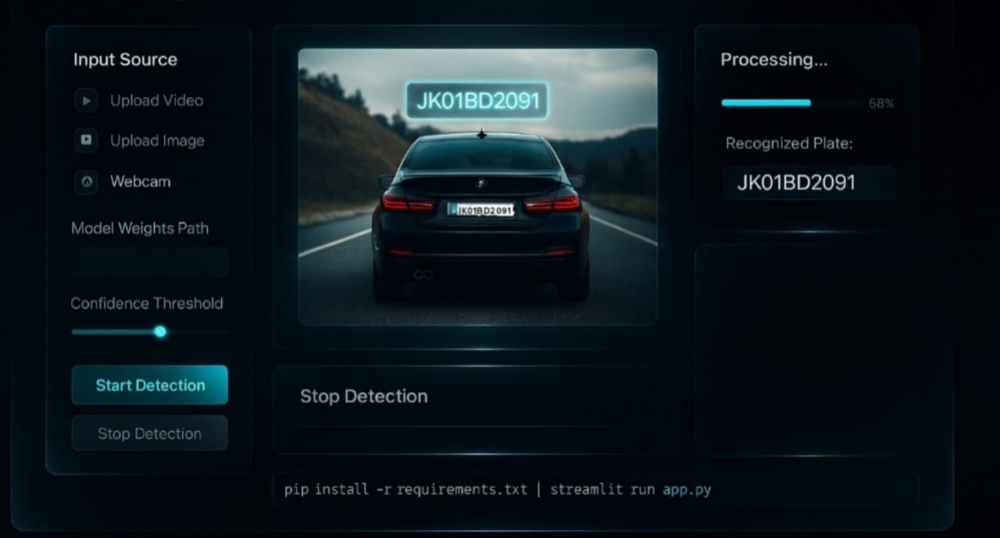

<h1 align="center">
🚗 Vehicle License Plate Detection & Recognition System  
</h1>

<em>Where computer vision meets real-world intelligence — redefining automation through vision, precision, and deep learning.</em>

 
---

  

  ⚙️ <em>VLPR System Interface Example</em>

---

##  Introduction  

The **Vehicle License Plate Detection and Recognition System (VLPR)** represents a cutting-edge fusion of AI, computer vision, and intelligent automation.  
Built to **detect, isolate, and recognize license plates** from real-world environments — this system bridges the gap between machine perception and smart surveillance.  

Crafted with the mindset of a data scientist and the precision of an engineer, it redefines how machines interpret visual data — fast, accurate, and adaptive.

> “Not just another model — this is an ecosystem of perception.”

---

<h2 align="center" style="color:#58a6ff; margin-bottom:20px;">Core Features — Intelligent, Adaptive, Real-Time</h2>

<table align="center" style="max-width:900px; border-collapse:collapse; margin-top:10px;">
  <tr>
    <th align="center" width="220" style="background-color:#0f111a;color:#00ffe6;font-size:18px;">Feature</th>
    <th align="center" style="background-color:#0f111a;color:#00ffe6;font-size:18px;">Purpose & Description</th>
  </tr>

  <tr>
    <td align="center" style="background-color:#111420;color:#e6e6e6;padding:15px;">
       <b>Real-Time License Plate Detection</b>
    </td>
    <td style="background-color:#111420;color:#e6e6e6;padding:15px;line-height:1.6;">
      Powered by <b>YOLOv8</b> for high-speed detection and localization of license plates in images and live video feeds.
    </td>
  </tr>

  <tr>
    <td align="center" style="background-color:#111420;color:#e6e6e6;padding:15px;">
       <b>Optical Character Recognition (OCR)</b>
    </td>
    <td style="background-color:#111420;color:#e6e6e6;padding:15px;line-height:1.6;">
      Extracts and decodes alphanumeric plate details with advanced OCR pipelines for minimal error rates, even in challenging lighting or distorted inputs.
    </td>
  </tr>

  <tr>
    <td align="center" style="background-color:#111420;color:#e6e6e6;padding:15px;">
       <b>Noise & Glare Correction</b>
    </td>
    <td style="background-color:#111420;color:#e6e6e6;padding:15px;line-height:1.6;">
      Applies <b>noise suppression, glare removal, and edge enhancement</b> to normalize input quality and maintain detection precision under real-world conditions.
    </td>
  </tr>

  <tr>
    <td align="center" style="background-color:#111420;color:#e6e6e6;padding:15px;">
       <b>Multi-Input Compatibility</b>
    </td>
    <td style="background-color:#111420;color:#e6e6e6;padding:15px;line-height:1.6;">
      Supports feeds from <b>webcams, CCTV, or uploaded files</b>, dynamically adapting to various input formats and resolutions.
    </td>
  </tr>

  <tr>
    <td align="center" style="background-color:#111420;color:#e6e6e6;padding:15px;">
       <b>Interactive Streamlit Dashboard</b>
    </td>
    <td style="background-color:#111420;color:#e6e6e6;padding:15px;line-height:1.6;">
      A clean, intuitive dashboard for <b>live visualization, performance metrics</b>, and detection previews — making experimentation seamless.
    </td>
  </tr>

  <tr>
    <td align="center" style="background-color:#111420;color:#e6e6e6;padding:15px;">
       <b>Scalable Modular Design</b>
    </td>
    <td style="background-color:#111420;color:#e6e6e6;padding:15px;line-height:1.6;">
      Engineered with a <b>plug-and-play architecture</b> for easy integration into <b>smart surveillance, toll monitoring</b>, and <b>automated access systems</b>.
    </td>
  </tr>
</table>

 
  <i style="color:#9be9a8; font-size:15px;">“Transforming computer vision from static detection to real-time intelligence.”</i> 

---

<h2 align="center" style="color:#58a6ff;"> Project Objectives</h2> <table align="center" style="max-width:900px; border-collapse:collapse; margin-top:10px;"> <tr> <th align="center" width="220" style="background-color:#0f111a;color:#00ffe6;font-size:18px;">Objective</th> <th align="center" style="background-color:#0f111a;color:#00ffe6;font-size:18px;">Purpose & Description</th> </tr> <tr> <td align="center" style="background-color:#111420;color:#e6e6e6;padding:15px;">  <b>Accurate Detection</b> </td> <td style="background-color:#111420;color:#e6e6e6;padding:15px;line-height:1.6;"> Deploy <b>YOLOv8</b> for precise and efficient license plate detection in images and live video feeds, ensuring high accuracy under varying environmental conditions. </td> </tr> <tr> <td align="center" style="background-color:#111420;color:#e6e6e6;padding:15px;">  <b>Character Recognition</b> </td> <td style="background-color:#111420;color:#e6e6e6;padding:15px;line-height:1.6;"> Utilize advanced <b>Optical Character Recognition (OCR)</b> to decode alphanumeric license plate characters with minimal error rates, even on distorted or low-contrast inputs. </td> </tr> <tr> <td align="center" style="background-color:#111420;color:#e6e6e6;padding:15px;">  <b>Smart Preprocessing</b> </td> <td style="background-color:#111420;color:#e6e6e6;padding:15px;line-height:1.6;"> Apply <b>noise suppression, glare removal, and edge enhancement</b> filters to normalize image quality and maintain detection precision under real-world conditions. </td> </tr> <tr> <td align="center" style="background-color:#111420;color:#e6e6e6;padding:15px;">  <b>Performance Evaluation</b> </td> <td style="background-color:#111420;color:#e6e6e6;padding:15px;line-height:1.6;"> Evaluate detection and recognition models using <b>precision, recall, and F1-score</b> metrics to benchmark accuracy and consistency across multiple datasets. </td> </tr> <tr> <td align="center" style="background-color:#111420;color:#e6e6e6;padding:15px;">  <b>Interactive Deployment</b> </td> <td style="background-color:#111420;color:#e6e6e6;padding:15px;line-height:1.6;"> Build and deploy an <b>interactive Streamlit dashboard</b> for real-time visualization, model testing, and seamless integration with smart monitoring systems. </td> </tr> </table>

 <i style="color:#9be9a8;">“Transforming computer vision from static detection to real-time intelligence.”</i> 

---

<h2 align="center" style="color:#58a6ff;"> Tech Stack</h2> 
 Built with a precision-engineered combination of deep learning, computer vision, and modern deployment tools. 
 
    

<table align="center" style="max-width:950px; border-collapse:collapse;"> <tr> <th align="center" width="220" style="background-color:#0f111a;color:#00ffe6;font-size:18px;">Technology</th> <th align="center" style="background-color:#0f111a;color:#00ffe6;font-size:18px;">Purpose & Role</th> </tr> <tr> <td align="center" style="background-color:#111420;padding:18px;">  <b style="color:#e6e6e6;">OpenCV</b> </td> <td style="background-color:#111420;color:#c9d1d9;padding:18px;line-height:1.6;"> Foundation of image preprocessing, edge detection, and contour analysis pipelines — powering noise reduction and plate region extraction. </td> </tr> <tr> <td align="center" style="background-color:#111420;padding:18px;">  <b style="color:#e6e6e6;">YOLOv8</b> </td> <td style="background-color:#111420;color:#c9d1d9;padding:18px;line-height:1.6;"> Advanced object detection architecture used for ultra-fast, high-accuracy license plate localization in real-time video streams. </td> </tr> <tr> <td align="center" style="background-color:#111420;padding:18px;">  <b style="color:#e6e6e6;">Python</b> </td> <td style="background-color:#111420;color:#c9d1d9;padding:18px;line-height:1.6;"> Core programming language orchestrating detection logic, OCR pipelines, and model integration through modular, scalable scripts. </td> </tr> <tr> <td align="center" style="background-color:#111420;padding:18px;">  <b style="color:#e6e6e6;">Tesseract OCR</b> </td> <td style="background-color:#111420;color:#c9d1d9;padding:18px;line-height:1.6;"> Optical Character Recognition engine used for decoding alphanumeric license plate content post-detection, fine-tuned for real-world plate variations. </td> </tr> <tr> <td align="center" style="background-color:#111420;padding:18px;">  <b style="color:#e6e6e6;">Streamlit</b> </td> <td style="background-color:#111420;color:#c9d1d9;padding:18px;line-height:1.6;"> Web-based interactive dashboard framework enabling real-time detection visualization, live testing, and seamless user interaction. </td> </tr> <tr> <td align="center" style="background-color:#111420;padding:18px;">  <b style="color:#e6e6e6;">NumPy</b> </td> <td style="background-color:#111420;color:#c9d1d9;padding:18px;line-height:1.6;"> Handles matrix computations, array transformations, and pixel-level manipulations essential for image pre- and post-processing. </td> </tr> <tr> <td align="center" style="background-color:#111420;padding:18px;">  <b style="color:#e6e6e6;">Pandas</b> </td> <td style="background-color:#111420;color:#c9d1d9;padding:18px;line-height:1.6;"> Facilitates structured data management for model outputs, evaluation metrics, and tracking system performance across test datasets. </td> </tr> </table>

---

**📂 Vehicle-License-Plate-Recognition/**

│
**├── main.py                #  Core execution engine & pipeline orchestrator**

**├── utils.py               #  Utility functions for data preprocessing & helpers**

**├── add_missing_data.py    #  Handles incomplete datasets, validation & augmentation**

**├── Visualize.py           #  Real-time visual rendering, bounding boxes & analysis**

**├── streamlit_app.py       #  Interactive Streamlit dashboard for live testing**
│
**└── assets/                #  Contains model weights, sample images, and output snapshots**

    

---

<h2> Next-Gen Evolution Goals </h2>

|    Focus Area                    |    Innovation Path                                                                                                                                                  |
| :------------------------------- | :------------------------------------------------------------------------------------------------------------------------------------------------------------------ |
| **Transformer-based OCR**        | Incorporate *attention-driven architectures* for adaptive, multilingual character recognition — improving accuracy under occlusion and low-light.                   |
| **Edge-Optimized Inference**     | Deploy on lightweight platforms (e.g., *NVIDIA Jetson, Raspberry Pi*) for **on-site detection** with minimal latency.                                               |
| **Multi-Camera Synchronization** | Enable **parallel visual feeds** for 360° monitoring and cross-frame object tracking.                                                                               |
| **Advanced Visual Fidelity**     | Integrate **AI-driven glare suppression**, **motion stabilization**, and **dynamic noise reduction** for clear, stable plate extraction in real-world environments. |

  

---

<h3 style="text-align:center; color:#00ffff; font-weight:700; margin-bottom:10px;">👨‍💻 About the Author</h3>

<h2 align="center" style="
    background: linear-gradient(90deg, #00ffff, #58a6ff); 
    -webkit-background-clip: text; 
    color: #00ffff; 
    text-shadow: 0 0 8px #00ffff, 0 0 15px #58a6ff;
    font-size:2.5em;
    font-weight:800;
    margin-bottom:20px;">
  Aakif Altaf
</h2>

   
  Data Scientist | BCA & MCA Graduate | <b>IBM-Certified Data Scientist</b> | <b>Google-Certified Data Analyst</b> 
  Driven by curiosity, precision, and a relentless pursuit of intelligent automation in real-world systems.

  “Behind every intelligent system is a mind that sees patterns where others see noise and pixels.”

  
  

---

<h2 align="center">🌐 Explore Full VLPRs: An Intelligent Vision Framework</h2>
<h3 align ="center"> Click Below To View 

 ---
 

  

---

 
---

 Designed and engineered with precision, purpose, and passion.  

