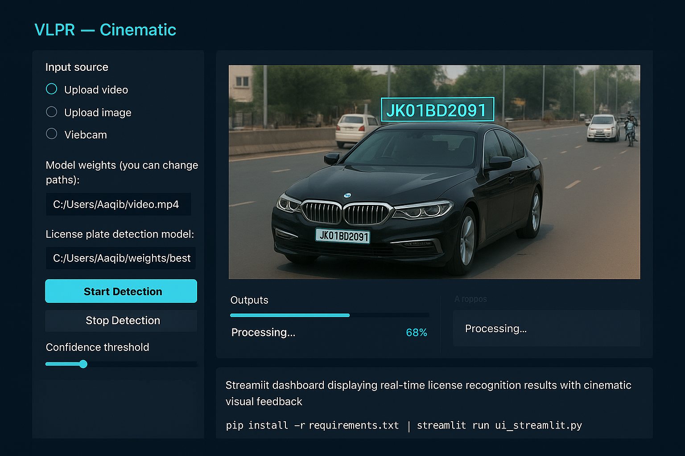

<h1 align="center">
🚗✨ Vehicle License Plate Detection & Recognition System  
</h1>

<em>Where computer vision meets real-world intelligence — redefining automation through vision, precision, and deep learning.</em>

 
---

---

## 🧠 Introduction  

The **Vehicle License Plate Detection and Recognition System (VLPR)** represents a cutting-edge fusion of AI, computer vision, and intelligent automation.  
Built to **detect, isolate, and recognize license plates** from real-world environments — this system bridges the gap between machine perception and smart surveillance.  

Crafted with the mindset of a data scientist and the precision of an engineer, it redefines how machines interpret visual data — fast, accurate, and adaptive.

> “Not just another model — this is an ecosystem of perception.”

---

## ⚙️ Features  

✅ **Real-Time License Plate Detection** using YOLOv8  
✅ **Character Recognition** via Optical Character Recognition (OCR)  
✅ **Noise Reduction & Glare Correction** for accuracy in dynamic lighting  
✅ **Video Stream & Image Input** compatibility  
✅ **Interactive Streamlit Dashboard** for visualization  
✅ **Scalable, modular architecture** for integration into smart systems  

---

## 💡 Tech Stack  

   
  
  
  

Built with the precision of the following technologies:

  
  
  
  
  
  
  

---

## 🚀 Project Architecture  

├── main.py # Core execution and model orchestration

├── utils.py # Helper functions for data processing

├── add_missing_data.py # Handles incomplete datasets & preprocessing

├── Visualize.py # Visual rendering and analysis

├── streamlit_app.py # Interactive web-based interface

└── assets/ # Images, outputs, and model weights

---

## 🔮 Vision & Future Work  

The journey doesn’t end here.  
Future iterations aim to **leverage Transformer-based OCR**, **edge-optimized inference**, and **multi-camera synchronization** to achieve **ultra-low latency recognition**.  

From glare reduction to motion stabilization, this system is evolving toward **the future of autonomous surveillance** and **AI-powered mobility** — the foundation of next-generation smart cities.

---

## 👨‍💻 About the Author  

<h3 align="center">Aakif Altaf</h3>

<em>Data Scientist | BCA & MCA Graduate | IBM Certified Data Scientist | Google Certified Data Analyst</em> 
Driven by curiosity, precision, and a relentless pursuit of intelligent automation.  

“Behind every model is a mind that sees patterns where others see pixels.”  

---

## 🌐 Explore Full VLPRs: An Intelligent Vision Framework  

---

 
---

⚡ Designed and engineered with precision, purpose, and passion.  

